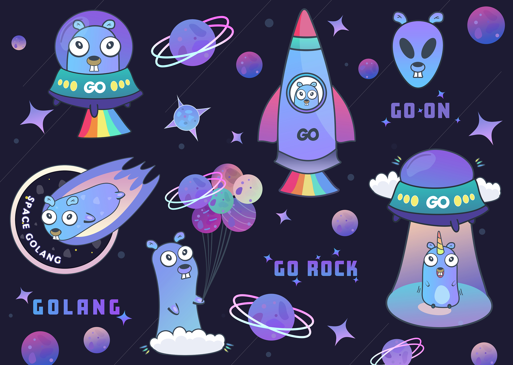

# space_gophers
## Meet the New Space Gophers!

The Go gopher was designed by the awesome [Renée French](http://reneefrench.blogspot.com/). Read http://blog.golang.org/gopher for more details.

## Shop

If you want some fun gophers __t-shirts, mugs, stickers on a laptop__ - now you can buy them with delivery:  
✨👉 [TeePublick](https://www.teepublic.com/user/coding-planet/albums/95234-golang-gophers) 👈✨

✨👉 [Metal posters](https://displate.com/karisl) 👈✨

## License
This work is licensed under a [Creative Commons Attribution-NonCommercial-ShareAlike 4.0 International License](https://creativecommons.org/licenses/by-nc-sa/4.0/)

But! 

This artwork can not be used for commercial purposes (anywhere revenue is obtained, including advertising).
Both companies and individuals can use provided content for non-commercial purposes for FREE with NO attribution.
Projects devoted to education, software development in Go Programming Language, and charity can use the content for FREE with attribution even for commercial purposes.
Please see full [LICENSE](https://github.com/karinkasweet/space_gophers/blob/main/LICENSE) terms for details.

## About me
My name is Karina Slizova, I am a professional illustrator and graphic designer, some of my works can be found here:

Created by [Karina Slizova](https://twitter.com/slizovakari)

Drop me an email, if you have any questions or suggestions:
✉ karinkasvit@gmail.com

## My other projects

If you liked this project, you may also want to see

[Gophers set on Github](https://github.com/karinkasweet/Gopher-sticker-pack)

[Cyberpunk Gophers](https://github.com/karinkasweet/Cyberpunk-gophers)

[Gophers set on Redbubble](https://www.redbubble.com/shop/ap/63226432)

