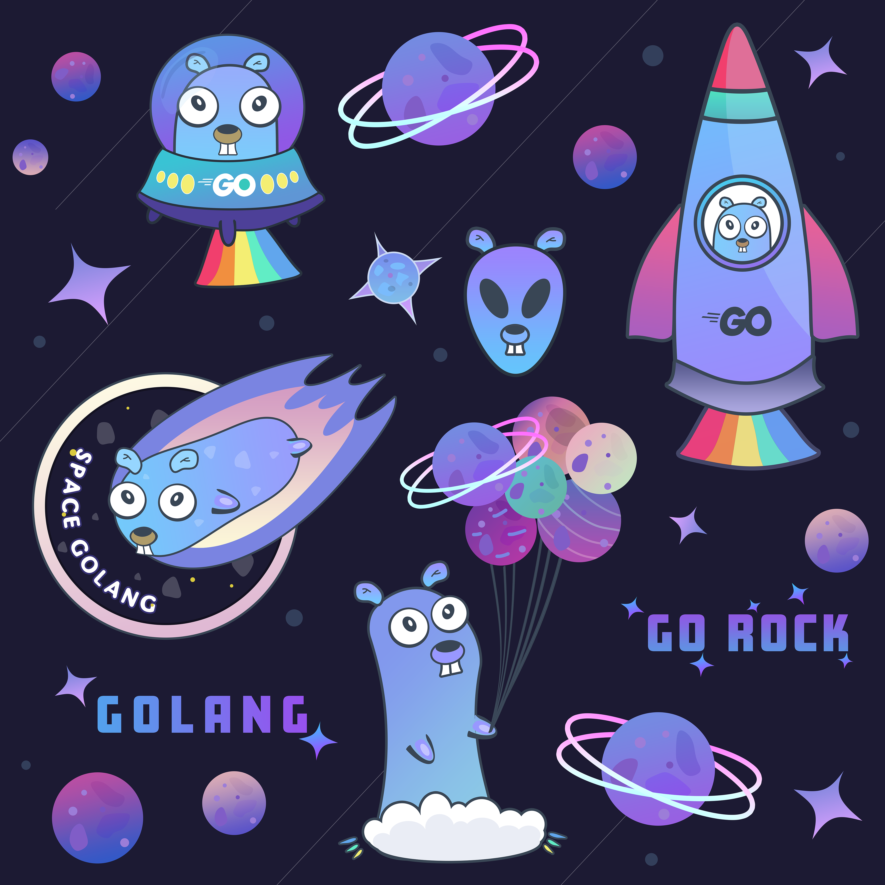

# space_gophers
## Meet the New Space Gophers!

The Go gopher was designed by the awesome Renee French. Read http://blog.golang.org/gopher for more details.

## Shop

If you want some fun gophers __t-shirts, mugs, stickers on a laptop__ - now you can buy them with delivery to any place around the world:  
✨👉 [Redbubble](https://www.redbubble.com/people/programzombie/explore?asc=u&page=1&sortOrder=recent) 👈✨

## License
Both companies and individuals can use provided content for non-commercial purposes for FREE with NO attribution.
Projects devoted to education, software development in Go Programming Language, and charity can use the content for FREE with attribution even for commercial purposes.
Please see full [LICENSE](https://github.com/karinkasweet/space_gophers/blob/main/LICENSE) terms for details.

## About me
My name is Karina Slizova, I am a professional illustrator and graphic designer, some of my works can be found here:

🎨 Metal posters https://displate.com/karisl

🎨 Redbubble      https://www.redbubble.com/people/programzombie/shop?asc=u

Drop me an email, if you have any questions or suggestions:
✉ karinkasvit@gmail.com

## My other projects

If you liked this project, you may also want to see [Gophers set](https://www.redbubble.com/shop/ap/63226432).

